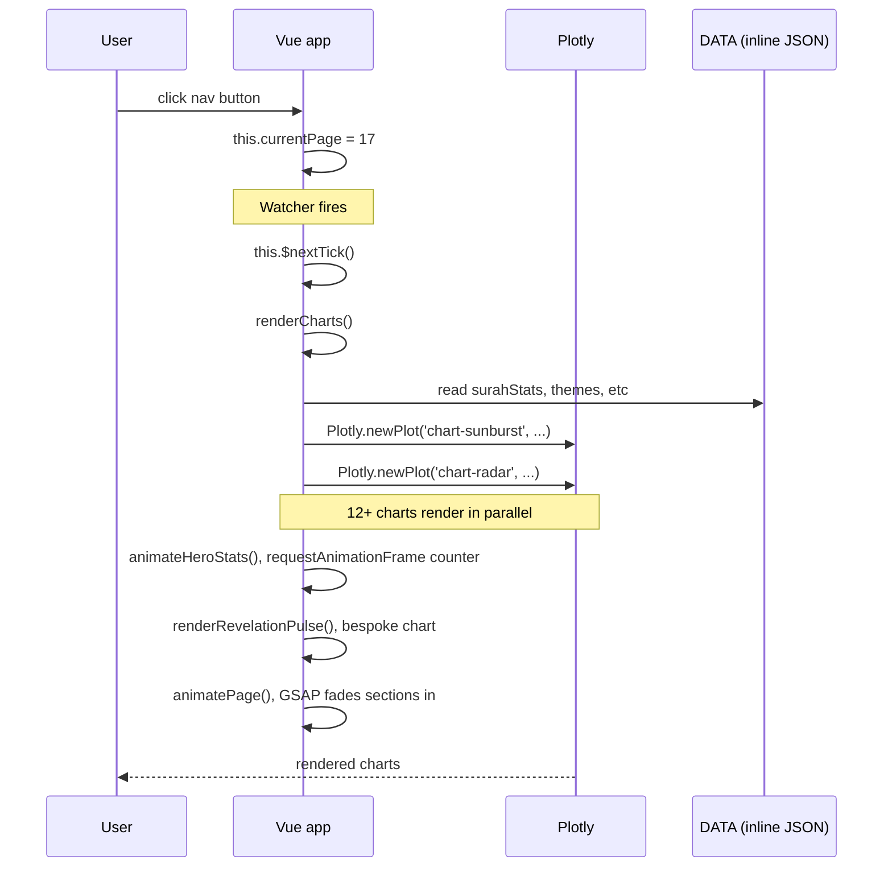
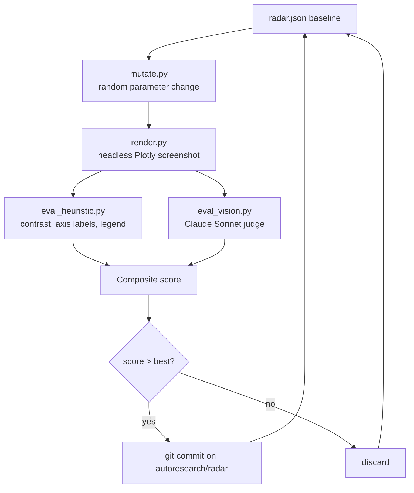

# Architecture

A deep dive into how Quran Text Analytics is built. For a high-level overview see [README.md](README.md).

## Design principles

1. **Single-file frontend**: the entire Vue app lives in `electron-app/app.html` (~9,900 lines). No build step, no bundler, no webpack config. This is deliberate: it makes the project trivially auditable, embeddable, and forkable. Anyone can open the file and read top-to-bottom.
2. **Offline-first data**: all 6,236 verses, scholarly tafsir, and surah metadata are bundled as JSON inside the distribution. No API calls at runtime.
3. **Computed once, rendered many**: expensive operations (revelation order, thematic classification, tafsir corpus) live as inline constants. The runtime cost is rendering Plotly charts, nothing more.
4. **Bilingual everywhere**: every UI string, chart label, hover template, and content card is in both Arabic and English with a runtime `lang` toggle.

## File layout

```
quran-analytics/
├── electron-app/                 # The frontend + Electron shell
│   ├── app.html                  # ~9,900 lines: Vue app + inline data + all UI
│   ├── main.js                   # Electron main process (window + menu)
│   ├── package.json              # Electron-builder config (universal Mac binary)
│   ├── icon.icns, icon.png       # App icons
│   ├── quran_duas.js             # Du'a content (~114 KB)
│   ├── quran_lessons.js          # Lesson content (~46 KB)
│   ├── quran_stories_data.js     # Stories content (~52 KB)
│   └── quran_tafsir_insights.js  # External tafsir mirror (~108 KB)
├── data/                         # Source data (raw inputs)
├── tableau/                      # Tableau dashboards built on the CSVs
├── autoresearch/                 # Karpathy-style chart auto-tuning loop
│   ├── orchestrator.py
│   ├── mutate.py
│   ├── render.py
│   ├── eval_heuristic.py
│   ├── eval_vision.py            # Claude Vision API judge
│   └── README.md
├── app.py                        # Python data-preprocessing pipeline
├── enrich_data.py                # Derives statistics from raw quranjson
├── build_cinematic.py            # Builds the cinematic standalone HTML version
├── verses_compact.json           # Per-verse compact format (~747 KB)
├── quran_madani.json             # Full Madani text (~1.4 MB)
├── surah_extended.json           # Per-surah extended statistics (~31 KB)
└── ROADMAP.md                    # Phase 2 ML upgrades
```

## How a page renders



## The DATA inline object

The `const DATA = {...}` block at the bottom of `app.html` is ~50 KB of precomputed JSON. Top-level keys:

| Key | Shape | Purpose |
|-----|-------|---------|
| `surahStats` | `{n, ar, en, p, vc, wc}[]` × 114 | Per-surah metadata: name, place, verse count, word count |
| `letters` | `{l, c}[]` × 28 | Frequency of each Arabic letter |
| `topWords` | `{w, c}[]` × 200 | Most frequent Arabic words |
| `pronouns` | `{we, i, he}` | Divine pronoun distribution |
| `sciCategories`, `scientificRefs` | array | Scientific signs in the Quran |
| `themes` | array | Thematic categorization |
| `numerical patterns` | nested | The 19 patterns, abjad calculations, iron miracle |

Everything else (verses, tafsir, etc.) is loaded as separate JSON files at app boot.

## The AutoResearch chart-tuning loop

This experiment lives in `autoresearch/`. It applies Andrej Karpathy's autoresearch pattern (released March 2026) to a concrete, measurable task: tuning Plotly chart configurations against a quality rubric.



**Why this is interesting**: most ML auto-tuning research targets model hyperparameters. This applies the same pattern to a visual/aesthetic optimization where the evaluator is itself an LLM looking at rendered screenshots. The orchestrator runs overnight, the chart improves measurably, and every winning mutation is git-committed for review.

See [`autoresearch/README.md`](autoresearch/README.md) for the full experiment design, killswitch, and resume protocol.

## Page 17 deep dive (Advanced Analytics)

The most complex page. 12+ Plotly charts plus the three Phase-1 additions (hero stats, DYK carousel, revelation pulse). Render lifecycle:

1. Watcher on `currentPage` fires when user navigates to page 17
2. `$nextTick(() => ...)` ensures the DOM is mounted before Plotly tries to find chart containers
3. `renderCharts()` handles the page-shared charts (sunbursts, treemap, heatmap, box plot, parallel coords)
4. `renderAdvancedCharts()` handles all page-17-specific Plotly renders
5. Page 17 also calls `animateHeroStats()` (1.4s ease-out cubic counter animation) and `renderRevelationPulse()` (bespoke chronological bar chart with Hijra annotation)
6. `animatePage()` runs GSAP fade-ins on every `[data-anim]` element

Lang toggle triggers a re-render of the same lifecycle so all chart labels swap language.

## Why Electron rather than pure web

The desktop app distribution lets us bundle the full corpus (~21 MB) without bandwidth concerns, ship as a single-double-click executable, and access the file system for caching. Phase 2 plans to add a parallel static web build for the same source code, the Vue app already runs in any browser via `python3 -m http.server`.

## Performance notes

- Initial DOM mount: ~250 ms on a modern Mac
- Page 17 with 12 Plotly charts: ~600 ms render budget; we use `$nextTick` + `try/catch` per chart so a slow render never blocks the others
- Tafsir search: synchronous filter over 74 entries, fast, no debounce needed
- N-gram computation: cached per surah; first invocation ~150 ms for the full Quran scope
- Verse concordance: linear scan over `verses_compact.json` (~6,236 entries), ~80 ms, acceptable without indexing
