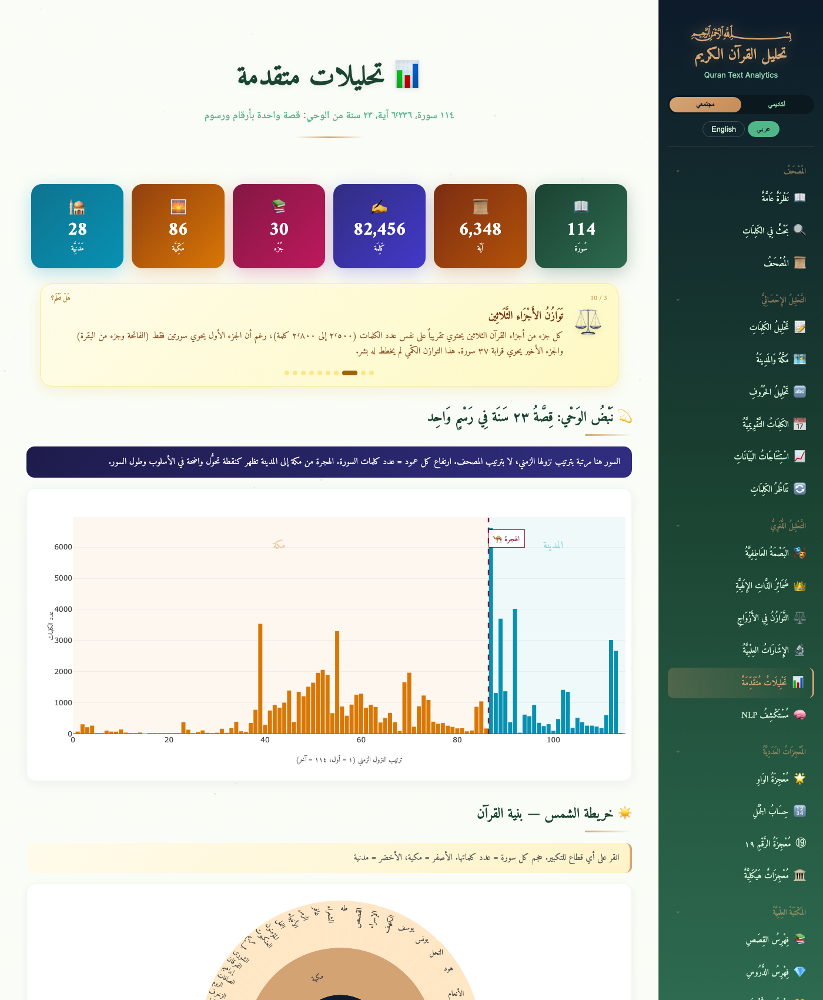
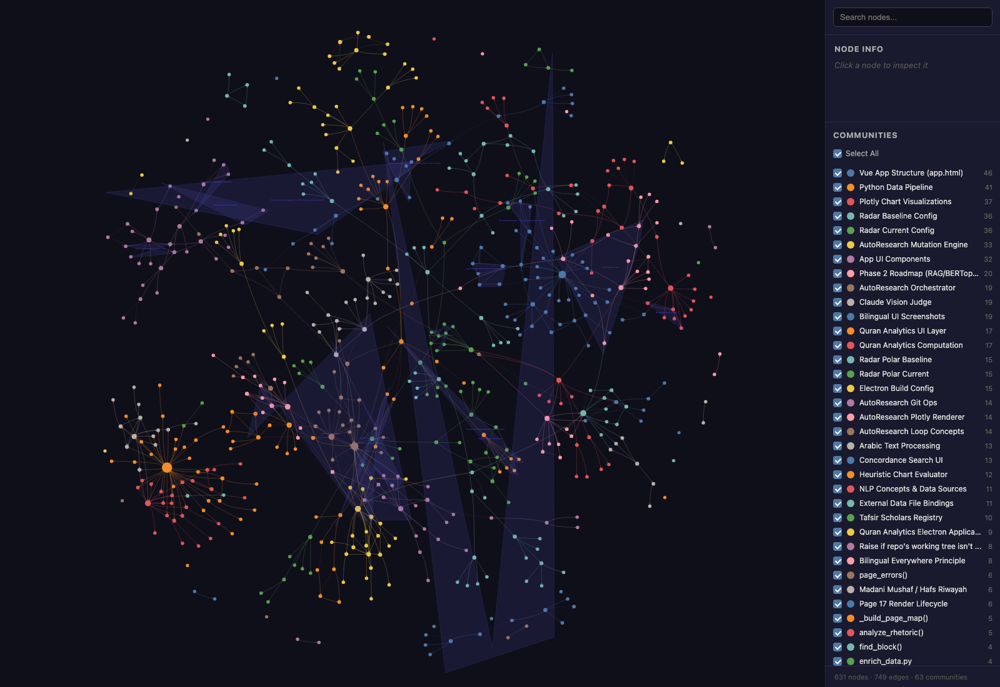
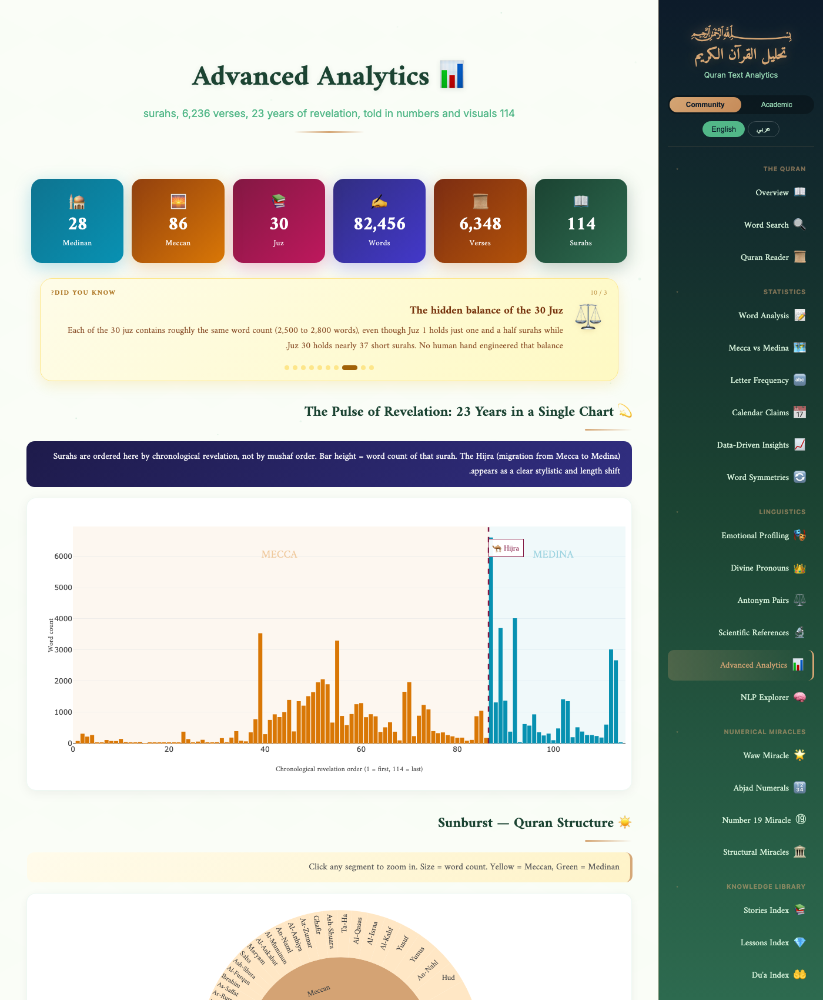
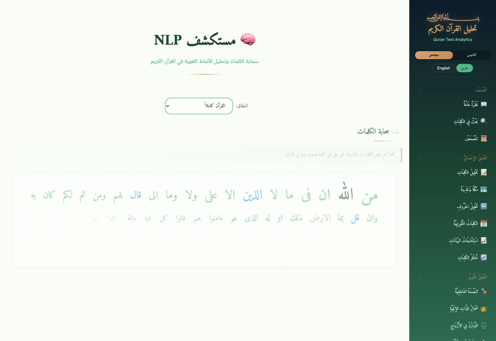
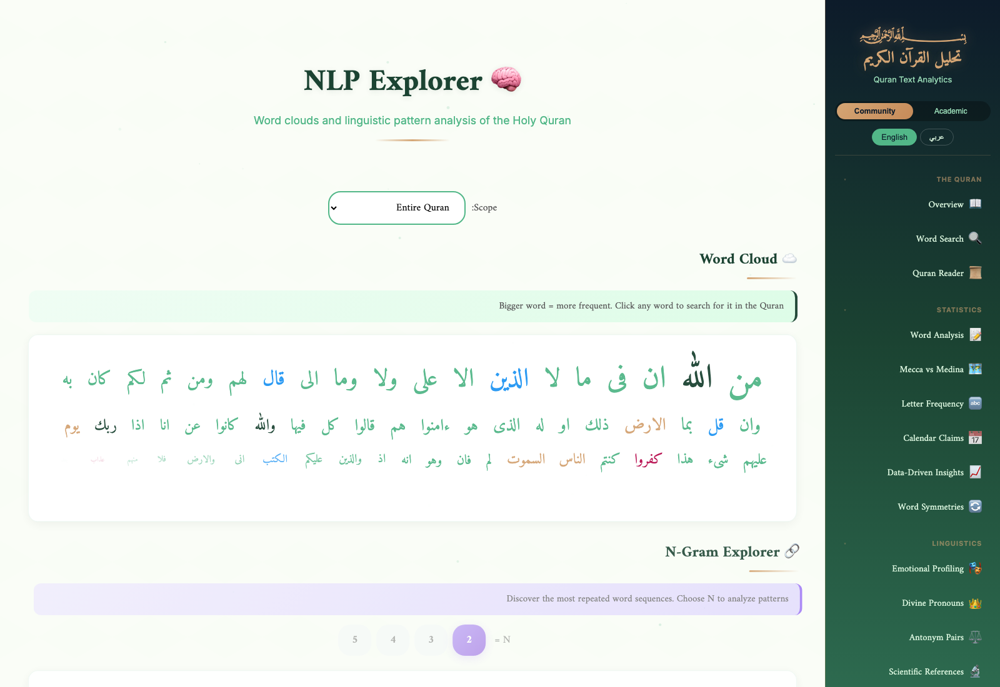
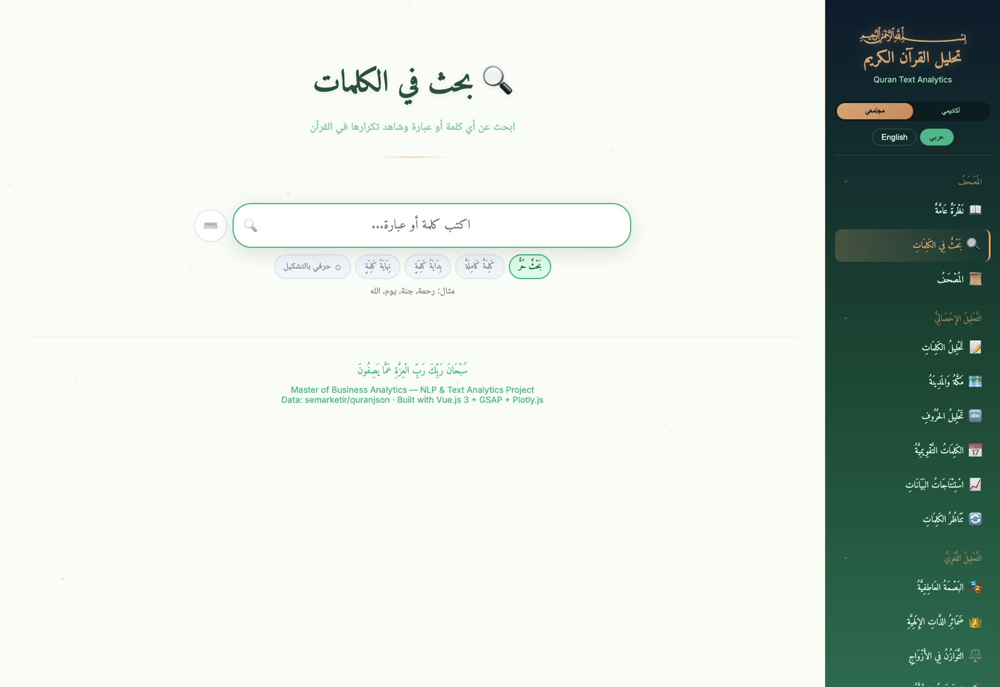
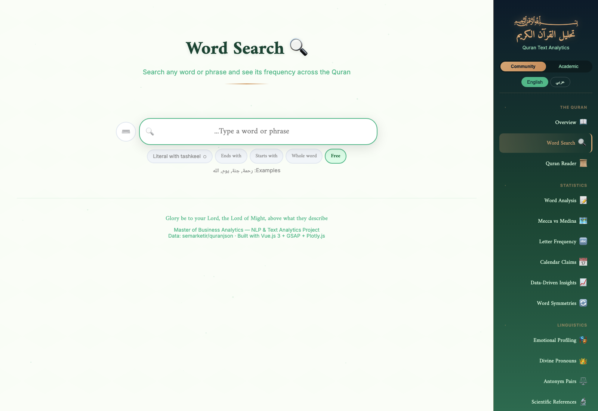
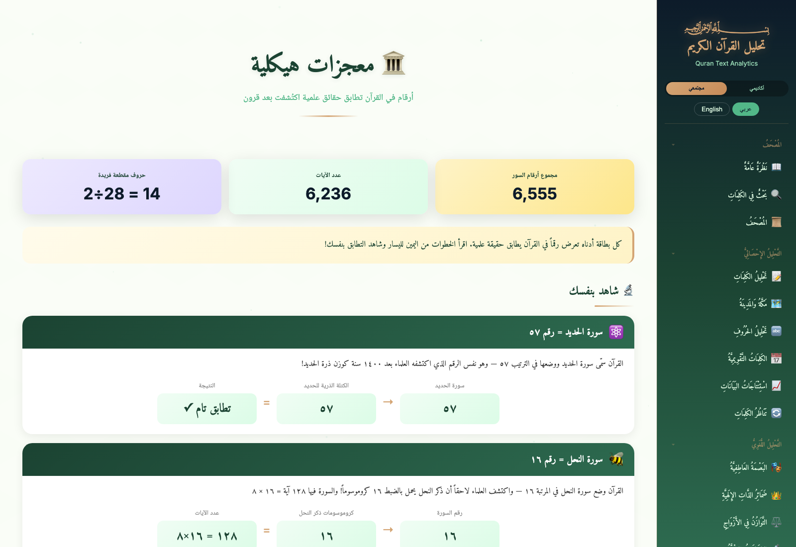
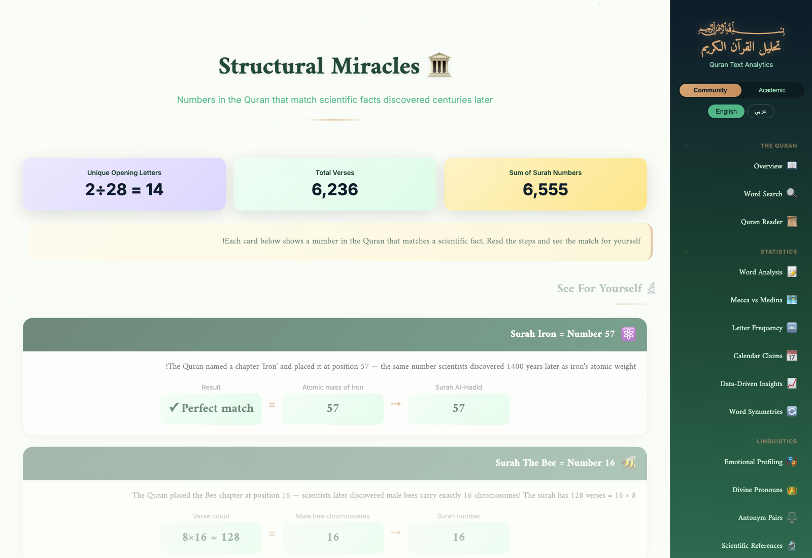
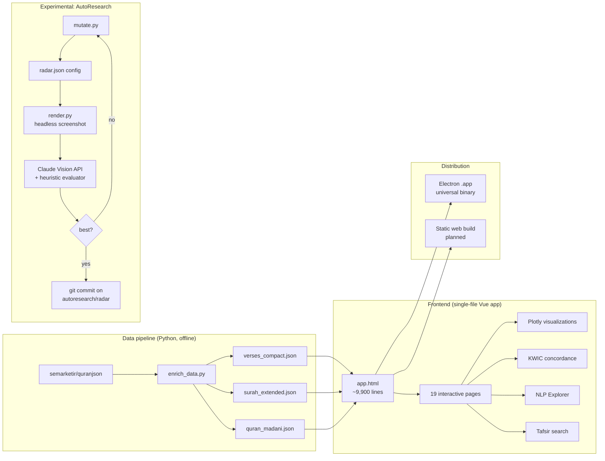

# Quran Text Analytics

> A fully bilingual (Arabic + English) NLP and visualization platform for the Quranic corpus, 114 surahs, 6,236 verses, 77,449 words. Built with Vue 3, Plotly, and Electron, with an experimental LLM-vision-judged auto-tuning loop for chart quality.

<p align="center">
  
</p>

<p align="center">
  <a href="#live-demo">Live demo</a> ·
  <a href="#bilingual-by-design">Bilingual</a> ·
  <a href="#features">Features</a> ·
  <a href="#screenshots">Screenshots</a> ·
  <a href="#architecture">Architecture</a> ·
  <a href="ROADMAP.md">Roadmap</a> ·
  <a href="#install">Install</a>
</p>

---

## Live demo

| Surface | Status | Link |
|---------|--------|------|
| Web demo (read-only) | Planned (Phase 2) | _coming soon_ |
| Desktop app (macOS universal) | Available | [Download v1.0](releases) |

Deep-link any page in either language: `app.html?page=17&lang=en` opens the Advanced Analytics page in English, `?page=15&lang=ar` opens the concordance in Arabic.

## What it does

A single-file Vue.js 3 application (~9,900 lines) that turns the Quranic corpus into 19 interactive pages of structured analytics. **Fully bilingual Arabic and English** throughout (see [Bilingual by design](#bilingual-by-design)), no backend, runs as a desktop Electron app or static web build.

## Bilingual by design

This is not a translation layer bolted onto an English app. Every single user-facing string, chart label, Plotly hover template, category badge, scholarly tafsir entry, search result, and navigation control is implemented in **both Arabic and English in parallel**, with a single runtime `lang` toggle that swaps the entire interface (including RTL/LTR text direction, RTL chart axis layout, and right-aligned typography for Arabic).

The reason: as a native Arabic speaker now studying analytics in English, I think in both languages and wanted a tool that respected both, rather than forcing one to feel like the translated cousin of the other.

| Layer | Arabic | English |
|-------|--------|---------|
| UI strings | Hand-authored Amiri-font Arabic | Hand-authored English |
| Plotly chart hover templates | Bilingual via runtime template selection | Same |
| Tafsir insights (74 entries) | Original Arabic + scholar attribution | Original English (not machine translated) |
| Stories index, du'as, lessons | Full Arabic content | Full English content |
| Text direction | RTL across charts, search, lists | LTR |
| Search & concordance | Tashkeel-aware Arabic input via on-screen Arabic keyboard | Standard English input |

See the [Screenshots](#screenshots) section below for the same pages rendered in both languages side by side.

## Features

### Visualization (Page 17, Advanced Analytics)
- **Animated hero stats dashboard**: 114 surahs · 6,236 verses · 77,449 words · 30 juz · 86 Meccan · 28 Medinan
- **Did-You-Know carousel**: 10 curated insights surfacing patterns most readers never notice (Bismillah's 113 occurrences, Ar-Rahman's 31x refrain, the perfect 30-juz word-count balance)
- **Revelation Pulse chart**: all 114 surahs in chronological order with the Hijra dashed line marking the Meccan→Medinan stylistic shift
- **3 sunburst charts**: Quran structure, 30 juz, and scholarly thematic classification
- **Surah DNA radar**: multi-dimensional comparison with 12 preset surah groups, smart dimension filter, find-similar-surahs, comparison matrix, correlation map, and galaxy view
- **Treemap, heatmap, box plots, parallel coordinates, polar area**: every dimension of the text visualized

### NLP Explorer (Page 18)
- **Word cloud** with click-through to concordance
- **N-gram explorer** (bigrams through 5-grams) with Plotly bar chart and paginated results table

### Concordance (Page 15)
- KWIC (Key Word In Context) view of every matching verse
- Tashkeel-aware Arabic search with bilingual results
- Meccan/Medinan color coding
- Paginated 50 results per batch

### Tafsir Insights (Page 14)
- **74 scholarly insights** spanning 11 surahs and 8 named scholars (Al-Samarrai, Ibn Kathir, Al-Tabari, Al-Qurtubi, Al-Sa'di, Ibn Ashur, Al-Sha'rawi, Sayyid Qutb)
- Categorized: Divine Wisdom · Linguistic Miracle · Scientific Signs · Historical Context · Quranic Rhetoric · Theology · Ethics · Recitation
- Each insight linked to YouTube lectures or scholarly tafsir sources where applicable
- Full-text search with on-screen Arabic keyboard

### Mushaf Reader, Stories Index, Du'a Library, Lessons
- Madani mushaf layout
- Searchable Quranic stories index with cast of figures and themes
- 100+ du'as cataloged by topic
- Educational lesson cards

### Experimental: AutoResearch chart-tuning loop (`autoresearch/`)
- Adapts [Karpathy's autoresearch pattern](https://github.com/karpathy/autoresearch) (released March 2026) to Plotly chart configuration
- Iteratively mutates `electron-app/charts/configs/radar.json`
- Scores each mutation with a hybrid evaluator: heuristic metrics + Claude Vision API judging rendered screenshots
- Commits wins on the `autoresearch/radar` branch
- See [`autoresearch/README.md`](autoresearch/README.md) for the experiment design

### Two knowledge graphs (`graphify-out/`)

This project ships **two** distinct knowledge graphs, both built with [graphify](https://github.com/safishamsi/graphify) (Karpathy-adjacent open-source tool for turning any folder into a queryable graph). Together they cover the full ML/data-science pipeline applied to one corpus: code structure AND content semantics.

#### 1. Code knowledge graph: the project itself, indexed

A hybrid AST + Claude-subagent extraction of every Python file, Vue component, screenshot, design doc, and the autoresearch loop. **631 nodes, 749 edges, 63 communities**, generated from a parallel pipeline (Python AST for deterministic structural edges + 6 parallel Claude general-purpose subagents for semantic and rationale edges across docs, screenshots, and the 9,900-line Vue app).

<p align="center">
  
</p>

| Output | Purpose |
|--------|---------|
| [`graphify-out/graph.html`](graphify-out/graph.html) | Interactive force-directed graph, open in any browser, click any node to inspect, filter by community |
| [`graphify-out/GRAPH_REPORT.md`](graphify-out/GRAPH_REPORT.md) | Audit report: god nodes, surprising cross-community connections, suggested questions, hyperedges, per-community deep-dives |
| [`graphify-out/graph.json`](graphify-out/graph.json) | Raw graph data for GraphRAG, agent retrieval, or Neo4j import |

**Top "god nodes"** (most central abstractions the graph surfaced):

| Rank | Node | Connections | Why it matters |
|------|------|-------------|----------------|
| 1 | `run()` in `autoresearch/orchestrator.py` | 27 | The iteration loop's central bridge. 6.6% of all shortest paths in the graph pass through this one function. |
| 2 | `Vue 3 Root Component` | 26 | The single source of truth for the entire app's reactive state. |
| 3 | `app.html` (~9,900 lines) | 17 | The project's main artifact, the file that everything else either feeds into or screenshots. |
| 4 | `tokenize_arabic()` | 16 | The linguistic backbone, used by every NLP feature. |
| 5 | `RadarRenderer` | 14 | The autoresearch subject of study, the chart being auto-tuned. |

**Benchmark**: graphify queries cost **15.9x fewer tokens** than naive grep over the same corpus (42,066 tokens corpus → ~2,644 tokens per query).

To regenerate after code changes: `/graphify --update` (incremental, only re-extracts changed files).

#### 2. Quranic content knowledge graph (planned, in progress)

The same technique applied to the Quran itself: ~170 generated markdown documents covering every surah, every named entity (prophets, places, divine attributes), every scholarly theme, and the special patterns (Bismillah, refrains, numerical miracles). Will produce a graph where:

- Communities cluster thematically (Stories of Moses, Day of Judgment, Mercy, Legislation, etc.)
- "God nodes" surface the most-referenced concepts (Allah, Faith, the Hereafter, the Prophets)
- Bridge nodes reveal verses that connect distant thematic clusters
- Entity links let you jump from any prophet to every verse they appear in

This is the kind of structural understanding of the Quranic text that classical concordances took lifetimes to compile, generated in hours from existing source data. See `quran_corpus/` for the source documents and [`graphify-out-quran/`](graphify-out-quran/) for the rendered graph (once built).

## Screenshots

The same page rendered in both languages. Every chart label, badge, hover template, and content card swaps via the runtime `lang` toggle. Notice the bidirectional layout: RTL/LTR text direction, chart axis flipping, and right-aligned vs left-aligned typography all swap together.

### Advanced Analytics (page 17): hero stats, Did-You-Know carousel, Revelation Pulse chart

| Arabic UI | English UI |
|:---:|:---:|
|  |  |

### NLP Explorer (page 18): word cloud + N-gram explorer

| Arabic UI | English UI |
|:---:|:---:|
|  |  |

### Concordance (page 15): tashkeel-aware KWIC search

| Arabic UI | English UI |
|:---:|:---:|
|  |  |

### Numerical Insights (page 14): verifiable Bismillah counts, 19-multiples, abjad patterns

| Arabic UI | English UI |
|:---:|:---:|
|  |  |

## Architecture



See [ARCHITECTURE.md](ARCHITECTURE.md) for the detailed deep-dive.

## Tech stack

| Layer | Technology |
|-------|------------|
| UI framework | Vue.js 3 (single-file app, no build step) |
| Charts | Plotly.js 2.27 |
| Animation | GSAP 3.12 |
| Desktop | Electron 28 (universal Intel + ARM Mac binary) |
| Data preprocessing | Python 3 (pandas, openpyxl) |
| AutoResearch evaluator | Anthropic Claude Sonnet 4.5 (Vision API) |
| Planned: NLP backend | Python (sentence-transformers, BERTopic), Ollama for local LLM |

## Roadmap

The shipped release focuses on descriptive analytics. Phase 2 extends into applied ML, see [ROADMAP.md](ROADMAP.md) for technical detail and milestones.

- [ ] **Semantic search** via `intfloat/multilingual-e5-large` embeddings, in-browser cosine similarity over 6,236 pre-computed verse vectors (~38 MB bundled)
- [ ] **Topic clustering** with BERTopic (offline Python pipeline → JSON topic map, interactive Plotly visualization)
- [ ] **RAG Q&A**, Ollama (local, Electron) or hidden Anthropic API (web demo). Top-K retrieval from embeddings + cited verse responses
- [ ] **Public web demo**, static Vercel build with embeddings/topics bundled

## Install

### Desktop (macOS)

```bash
git clone https://github.com/heshamrokaia/quran-text-analytics
cd quran-text-analytics/electron-app
nvm use 20    # requires Node 20
npm install
npm run build-mac
open dist/mac-universal/Quran\ Text\ Analytics.app
```

### Development (browser)

```bash
cd quran-text-analytics/electron-app
python3 -m http.server 8000
# Visit http://localhost:8000/app.html
```

### AutoResearch loop (advanced)

Requires an Anthropic API key for the vision evaluator.

```bash
cd quran-text-analytics
python3 -m venv .venv && source .venv/bin/activate
pip install -e autoresearch/
export ANTHROPIC_API_KEY='sk-ant-...'
python autoresearch/orchestrator.py --iterations 20
```

See [`autoresearch/README.md`](autoresearch/README.md) for full options.

## Data sources

- Quran Arabic text: [semarketir/quranjson](https://github.com/semarketir/quranjson) (Madani mushaf, Hafs riwayah)
- English translations: Sahih International, Yusuf Ali (public domain)
- Tafsir insights: original synthesis from Al-Samarrai's *Lamasat Bayania* lectures, Ibn Kathir, Al-Tabari, Al-Qurtubi, Al-Sa'di, Ibn Ashur, Al-Sha'rawi, Sayyid Qutb
- Thematic classification: scholarly categorization of all 114 surahs

## License

[MIT](LICENSE), text and visualizations are open for reuse with attribution. The underlying Quranic text is in the public domain.

## Author

**Hesham (Sam) Abourokaia**, Data Scientist with 14+ years in insurance analytics, currently completing a Master of Business Analytics at Deakin University in Australia.

Native Arabic speaker (Egyptian background) and fluent English (working and studying in English daily). This dual-language fluency is the reason the project was built bilingually from the first commit: every chart label, hover template, scholarly tafsir entry, and UI control swaps cleanly between Arabic and English via a runtime toggle, with proper RTL/LTR handling on both sides. It is not a translation layer, it is a parallel implementation.

Reach me on [LinkedIn](https://www.linkedin.com/in/heshamabourokaia/) or [GitHub](https://github.com/heshamrokaia).

---

<sub>Built between April and May 2026 as a learning project to apply NLP and information-design techniques to a corpus I care about. Feedback, issues, and PRs welcome.</sub>
