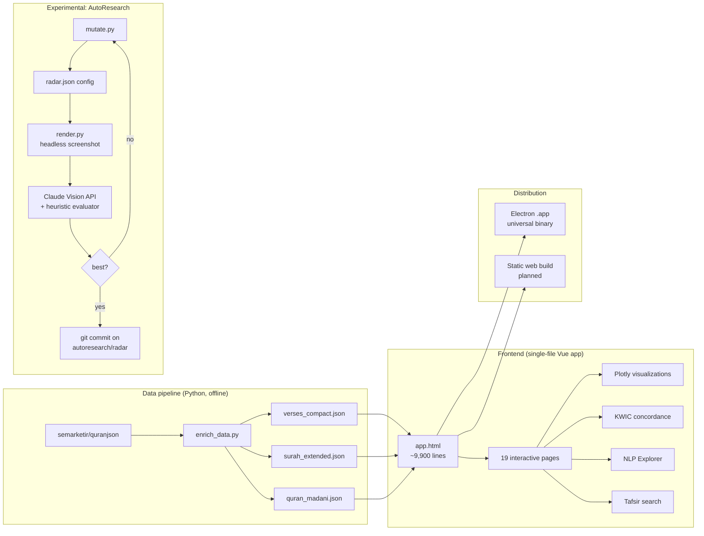

# Quran Text Analytics

> An interactive NLP and visualization platform for the Quranic corpus, 114 surahs, 6,236 verses, 77,449 words. Built with Vue 3, Plotly, and Electron, with an experimental LLM-vision-judged auto-tuning loop for chart quality.

<p align="center">
  
</p>

<p align="center">
  <a href="#live-demo">Live demo</a> ·
  <a href="#features">Features</a> ·
  <a href="#architecture">Architecture</a> ·
  <a href="ROADMAP.md">Roadmap</a> ·
  <a href="#install">Install</a>
</p>

---

## Live demo

| Surface | Status | Link |
|---------|--------|------|
| Web demo (read-only) | Planned (Phase 2) | _coming soon_ |
| Desktop app (macOS universal) | Available | [Download v1.0](releases) |

## What it does

A single-file Vue.js 3 application (~9,900 lines) that turns the Quranic corpus into 19 interactive pages of structured analytics. Bilingual Arabic/English throughout, no backend, runs as a desktop Electron app or static web build.

## Features

### Visualization (Page 17, Advanced Analytics)
- **Animated hero stats dashboard**: 114 surahs · 6,236 verses · 77,449 words · 30 juz · 86 Meccan · 28 Medinan
- **Did-You-Know carousel**: 10 curated insights surfacing patterns most readers never notice (Bismillah's 113 occurrences, Ar-Rahman's 31x refrain, the perfect 30-juz word-count balance)
- **Revelation Pulse chart**: all 114 surahs in chronological order with the Hijra dashed line marking the Meccan→Medinan stylistic shift
- **3 sunburst charts**: Quran structure, 30 juz, and scholarly thematic classification
- **Surah DNA radar**: multi-dimensional comparison with 12 preset surah groups, smart dimension filter, find-similar-surahs, comparison matrix, correlation map, and galaxy view
- **Treemap, heatmap, box plots, parallel coordinates, polar area**: every dimension of the text visualized

### NLP Explorer (Page 18)
- **Word cloud** with click-through to concordance
- **N-gram explorer** (bigrams through 5-grams) with Plotly bar chart and paginated results table

### Concordance (Page 15)
- KWIC (Key Word In Context) view of every matching verse
- Tashkeel-aware Arabic search with bilingual results
- Meccan/Medinan color coding
- Paginated 50 results per batch

### Tafsir Insights (Page 14)
- **74 scholarly insights** spanning 11 surahs and 8 named scholars (Al-Samarrai, Ibn Kathir, Al-Tabari, Al-Qurtubi, Al-Sa'di, Ibn Ashur, Al-Sha'rawi, Sayyid Qutb)
- Categorized: Divine Wisdom · Linguistic Miracle · Scientific Signs · Historical Context · Quranic Rhetoric · Theology · Ethics · Recitation
- Each insight linked to YouTube lectures or scholarly tafsir sources where applicable
- Full-text search with on-screen Arabic keyboard

### Mushaf Reader, Stories Index, Du'a Library, Lessons
- Madani mushaf layout
- Searchable Quranic stories index with cast of figures and themes
- 100+ du'as cataloged by topic
- Educational lesson cards

### Experimental: AutoResearch chart-tuning loop (`autoresearch/`)
- Adapts [Karpathy's autoresearch pattern](https://github.com/karpathy/autoresearch) (released March 2026) to Plotly chart configuration
- Iteratively mutates `electron-app/charts/configs/radar.json`
- Scores each mutation with a hybrid evaluator: heuristic metrics + Claude Vision API judging rendered screenshots
- Commits wins on the `autoresearch/radar` branch
- See [`autoresearch/README.md`](autoresearch/README.md) for the experiment design

## Screenshots

| NLP Explorer (page 18) | Concordance (page 15) | Numerical Insights (page 14) |
|:---:|:---:|:---:|
|  |  |  |
| Word cloud + N-gram explorer over the full corpus or a per-surah scope | Tashkeel-aware Arabic search with bilingual KWIC results | Verifiable numerical patterns (Bismillah counts, 19-multiples, abjad calculations) |

## Architecture



See [ARCHITECTURE.md](ARCHITECTURE.md) for the detailed deep-dive.

## Tech stack

| Layer | Technology |
|-------|------------|
| UI framework | Vue.js 3 (single-file app, no build step) |
| Charts | Plotly.js 2.27 |
| Animation | GSAP 3.12 |
| Desktop | Electron 28 (universal Intel + ARM Mac binary) |
| Data preprocessing | Python 3 (pandas, openpyxl) |
| AutoResearch evaluator | Anthropic Claude Sonnet 4.5 (Vision API) |
| Planned: NLP backend | Python (sentence-transformers, BERTopic), Ollama for local LLM |

## Roadmap

The shipped release focuses on descriptive analytics. Phase 2 extends into applied ML, see [ROADMAP.md](ROADMAP.md) for technical detail and milestones.

- [ ] **Semantic search** via `intfloat/multilingual-e5-large` embeddings, in-browser cosine similarity over 6,236 pre-computed verse vectors (~38 MB bundled)
- [ ] **Topic clustering** with BERTopic (offline Python pipeline → JSON topic map, interactive Plotly visualization)
- [ ] **RAG Q&A**, Ollama (local, Electron) or hidden Anthropic API (web demo). Top-K retrieval from embeddings + cited verse responses
- [ ] **Public web demo**, static Vercel build with embeddings/topics bundled

## Install

### Desktop (macOS)

```bash
git clone https://github.com/heshamrokaia/quran-text-analytics
cd quran-text-analytics/electron-app
nvm use 20    # requires Node 20
npm install
npm run build-mac
open dist/mac-universal/Quran\ Text\ Analytics.app
```

### Development (browser)

```bash
cd quran-text-analytics/electron-app
python3 -m http.server 8000
# Visit http://localhost:8000/app.html
```

### AutoResearch loop (advanced)

Requires an Anthropic API key for the vision evaluator.

```bash
cd quran-text-analytics
python3 -m venv .venv && source .venv/bin/activate
pip install -e autoresearch/
export ANTHROPIC_API_KEY='sk-ant-...'
python autoresearch/orchestrator.py --iterations 20
```

See [`autoresearch/README.md`](autoresearch/README.md) for full options.

## Data sources

- Quran Arabic text: [semarketir/quranjson](https://github.com/semarketir/quranjson) (Madani mushaf, Hafs riwayah)
- English translations: Sahih International, Yusuf Ali (public domain)
- Tafsir insights: original synthesis from Al-Samarrai's *Lamasat Bayania* lectures, Ibn Kathir, Al-Tabari, Al-Qurtubi, Al-Sa'di, Ibn Ashur, Al-Sha'rawi, Sayyid Qutb
- Thematic classification: scholarly categorization of all 114 surahs

## License

[MIT](LICENSE), text and visualizations are open for reuse with attribution. The underlying Quranic text is in the public domain.

## Author

**Hesham (Sam) Abourokaia**: Data Scientist with 14+ years in insurance analytics, currently completing a Master of Business Analytics at Deakin University. Reach me on [LinkedIn](https://www.linkedin.com/in/heshamabourokaia/) or [GitHub](https://github.com/heshamrokaia).

---

<sub>Built between April and May 2026 as a learning project to apply NLP and information-design techniques to a corpus I care about. Feedback, issues, and PRs welcome.</sub>
