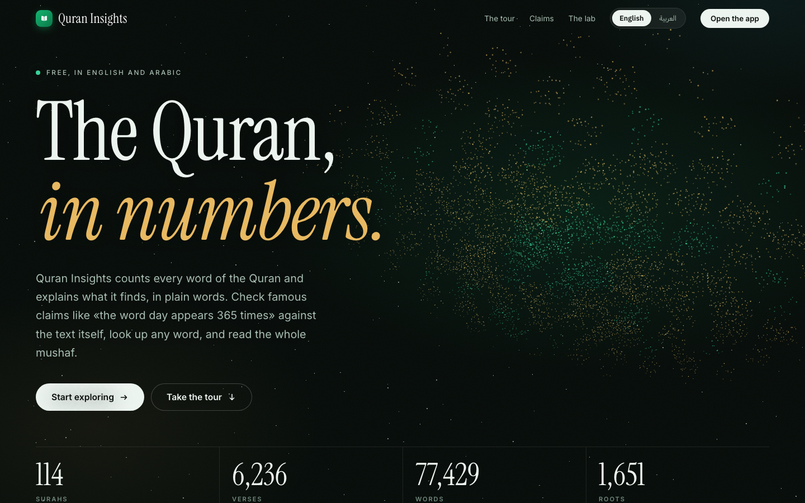
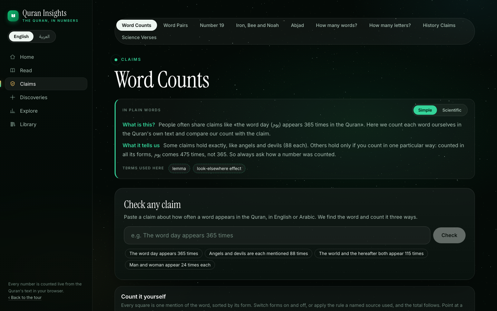
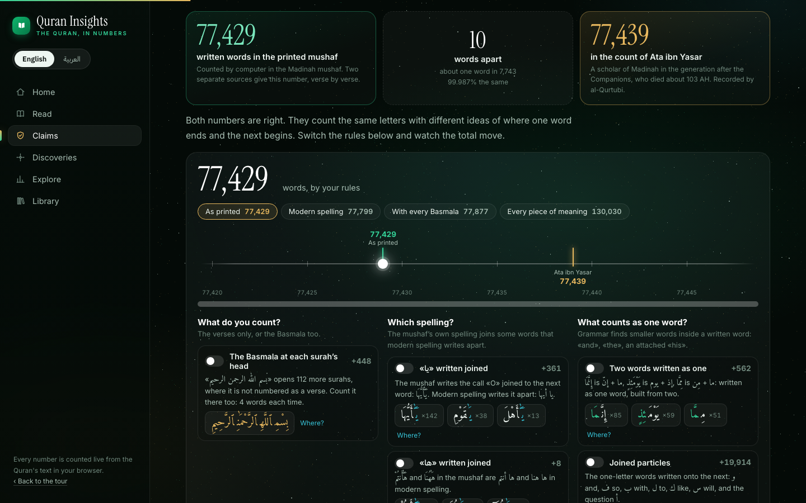
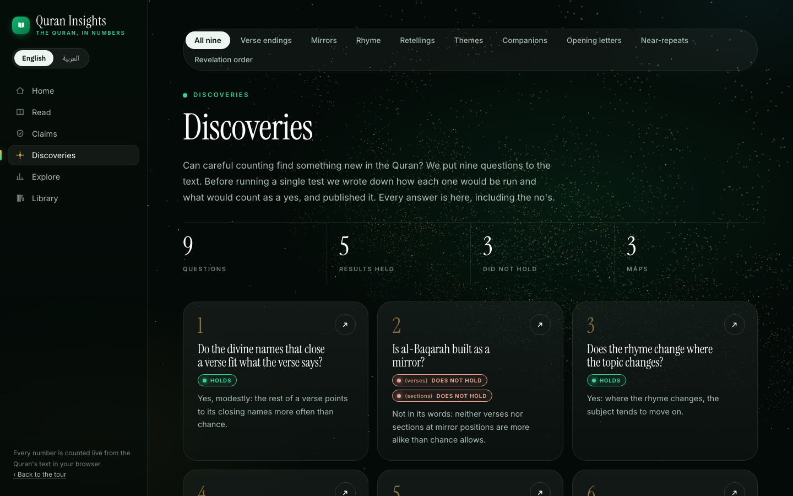
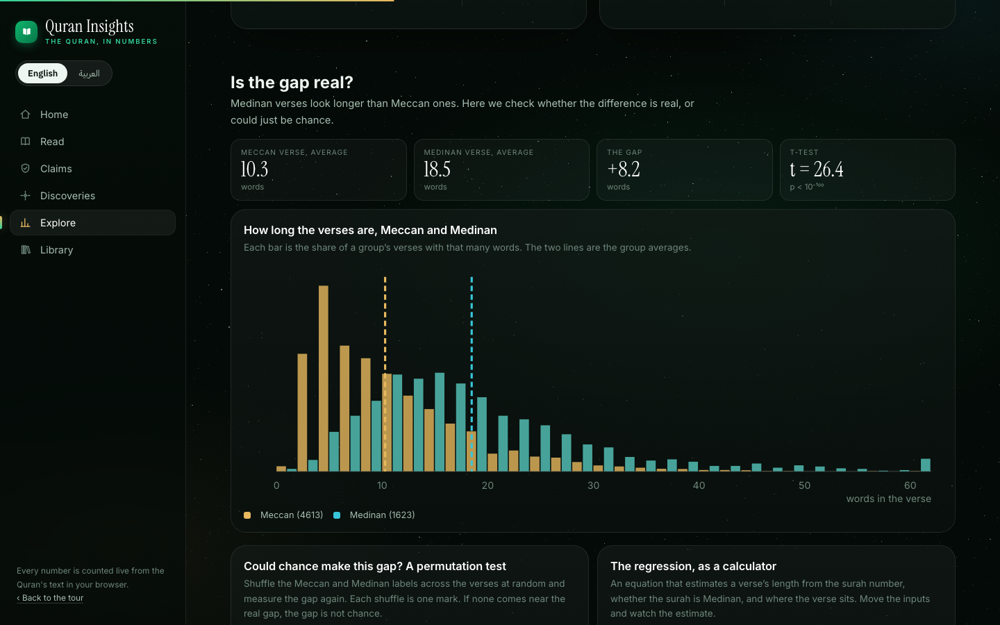

# Quran Insights

**The Quran, in numbers.** Famous claims checked against the text, nine questions tested against chance, and the whole mushaf to read and search. Everything is counted from the Quran's own text, explained in plain words, in English and Arabic.

**Live:** [quraninsights.vercel.app](https://quraninsights.vercel.app)



## What is on the site

The menu has five sections. Every page has a short address you can send to someone.

| Section | Pages | Short links |
|---|---|---|
| **Read** | Reader, Word Search, Mushaf Layouts, Hifz Planner | `/reader`, `/search`, `/mushaf-layouts`, `/hifz` |
| **Claims** | Word Counts, Word Pairs, Number 19, Iron, Bee and Noah, Abjad, How many words?, How many letters?, History Claims, Science Verses | `/word-counts`, `/word-pairs`, `/19`, `/iron-bee-noah`, `/abjad`, `/how-many-words`, `/how-many-letters`, `/history`, `/science` |
| **Discoveries** | Nine studies, each tested against chance with the test written down first | `/discoveries`, `/verse-endings`, `/mirrors`, `/rhyme`, `/retellings`, `/themes`, `/companions`, `/opening-letters`, `/near-repeats`, `/revelation-order` |
| **Explore** | Overview, Words, Letters, Mecca and Medina, Tone and Voice, Similar Surahs, Knowledge Graph | `/overview`, `/words`, `/letters`, `/mecca-medina`, `/tone`, `/similar-surahs`, `/knowledge-graph` |
| **Library** | Stories, Lessons, Du'as, Scholars' Insights, Untranslatable Words | `/stories`, `/lessons`, `/duas`, `/insights`, `/untranslatable` |

Add `?lang=ar` to any address for Arabic. A verse opens with `/reader?s=2&v=255`, and a history claim with `/history?c=weep`. Older links such as `app.html?view=n19` still work and land on the same page.

Most pages explain themselves twice: in plain words, and for scientists (data, method, result, limits), with a switch at the top of the page.

| | |
|---|---|
|  |  |
|  |  |

## How it is built

- **`web/`** is the whole site: a landing page (`index.html`) and one Vue 3 app (`app.html`) with no build step. The numbers come from generated data files (`data.js`, `words.js`, `corpus.js`), loaded as each page needs them.
- **`data-build/`** is the Python pipeline that produces those files from the Quranic Arabic Corpus, with tests that pin every published number.
- **`api/`** holds one Vercel function that lets a few boxes ask TypeSafe's Jev a typed question. It is optional; without it the site works the same with plain matching.

[ARCHITECTURE.md](ARCHITECTURE.md) has the details: the page system, short links, the data pipeline, the knowledge graph and Jev.

## Run it locally

```bash
python3 -m http.server 8765 --directory web
```

Then open <http://localhost:8765/app.html>. Locally the short links are off, so pages use `app.html?view=...` addresses.

## Rebuild the data

```bash
cd data-build
/usr/bin/python3 build.py
for t in tests/test_*.py; do /usr/bin/python3 "$t"; done
```

Use a Python with a working scikit-learn (the macOS system Python here). The build stops if the corpus totals change: 114 surahs, 6,236 verses, 77,429 words.

## Repository

```
web/            the site (deployed by Vercel)
data-build/     the data pipeline, its tests, and the knowledge-graph builder
api/            the optional Jev function
docs/           design notes, screenshots, a Tableau workbook
vercel.json     what Vercel serves, and the short links
```

## Data sources

- **Word-level morphology:** the [Quranic Arabic Corpus](https://corpus.quran.com) (Kais Dukes, University of Leeds), via [mustafa0x/quran-morphology](https://github.com/mustafa0x/quran-morphology), used with attribution.
- **Page layout of the Madinah mushaf:** [zonetecde/mushaf-layout](https://github.com/zonetecde/mushaf-layout), from the King Fahd Complex's 604-page print.
- **English translation:** M. M. Pickthall, *The Meaning of the Glorious Koran* (1930), public domain, verse-aligned text from the [Tanzil Project](https://tanzil.net/trans/).
- **Early word and letter counts:** al-Qurtubi, introduction to *al-Jami li-Ahkam al-Quran*.
- **Scholars' insights:** an original synthesis from al-Samarrai's *Lamasat Bayania* lectures, Ibn Kathir, al-Tabari, al-Qurtubi, al-Sa'di, Ibn Ashur, al-Sha'rawi and Sayyid Qutb.

## Licence

[MIT](LICENSE). The Quranic text is in the public domain.

## Author

**Hesham (Sam) Abourokaia**, Melbourne. A claims professional moving into analytics, finishing a Master of Business Analytics at Deakin University. Arabic is my first language, which is why the site was built in Arabic and English side by side from the first commit rather than translated afterwards.

[LinkedIn](https://www.linkedin.com/in/heshamabourokaia/) · [GitHub](https://github.com/HeshamAbourokaia)
